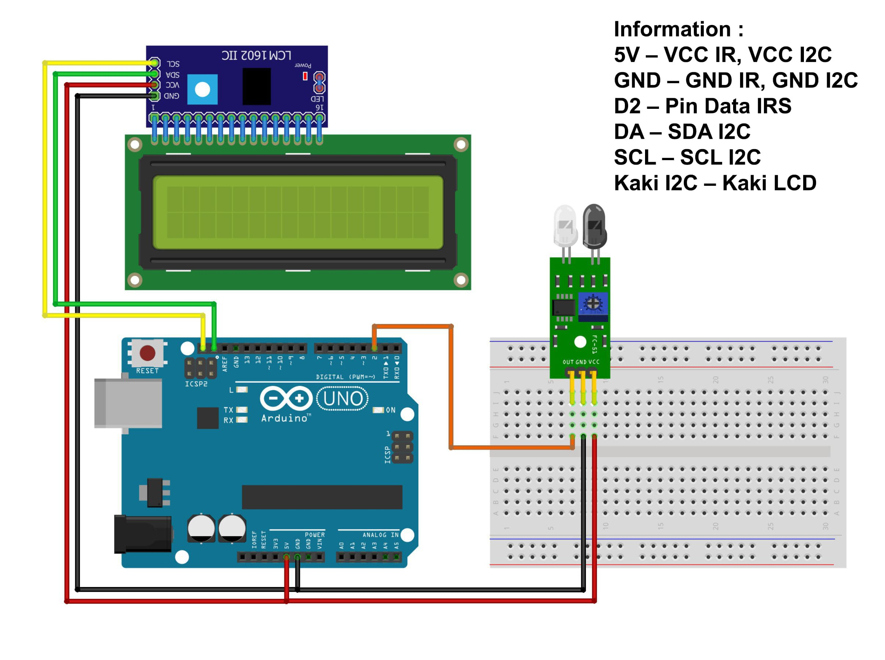

# Making RPM Counter (Tachometer) with IR Module --> (RPM Measurement with Arduino)

Create an RPM counter (tachometer) with Arduino using an IR sensor and LCD module. This project calculates RPM based on sensor interrupts and displays the result on a 16x2 LCD. Perfect for measuring rotational speed, it includes circuit details, code, and setup instructions for accurate RPM readings.

This project measures the RPM (Revolutions Per Minute) of a rotating object using an Arduino, an IR sensor, and an LCD display. The RPM is calculated based on the number of interrupts triggered by the IR sensor and displayed on the LCD.

## Components

- Arduino IDE;
- Library: LiquidCrystal_I2C;
- Arduino UNO = 1 piece;
- IR Sensor = 1 piece;
- LCD Display (16x2) with I2C = 1 piece;
- Project Board / Breadboard = 1 piece;
- Jumper Wires.

## Schematic Image

- Below you can see a schematic image to facilitate the wiring of cables from the microcontroller to devices, both input and output sensors:



## Circuit Diagram (Wiring)

- **IR Sensor:**

  - Signal Pin to Arduino Pin D2
  - VCC to Arduino 5V
  - GND to Arduino GND

- **LCD Display with I2C:**
  - SDA to Arduino A4
  - SCL to Arduino A5
  - VCC to Arduino 5V
  - GND to Arduino GND

## Work steps

- Prepare the tools and materials to be used.
- Carry out the wiring process using Figure schematic of the above circuit.
- Open the Arduino IDE software that has been installed on laptop/computer.
- Download all the libraries above and insert the library by opening the Arduino IDE, selecting Sketch > Include Library -> Add.Zip Library.
- Type the program sketch on the Arduino IDE page.
- Enter the I2C LCD address in the sketch program.
- Carry out the program uploading process.

## Code Explanation

- **Interrupt Handling:** The `rpm_fun()` function increments the `rpmcount` variable each time the IR sensor triggers an interrupt (on the falling edge).
- **RPM Calculation:** The RPM is calculated every second by measuring the time elapsed and counting the number of interrupts. The formula used is `30*1000/(millis() - timeold)*rpmcount`, adjusted for the specific application (e.g., number of blades or revolutions per interrupt).
- **LCD Display:** The RPM value is displayed on a 16x2 LCD screen.

## Code

```cpp
volatile byte rpmcount;
unsigned int rpm;
unsigned long timeold;

#include <LiquidCrystal_I2C.h>
LiquidCrystal_I2C lcd(0x27,16,2);

void rpm_fun()
{
  rpmcount++;
}

void setup()
{
  lcd.init ();
  lcd.setBacklight(HIGH);

  // Interrupt 0 is digital pin 2, so that is where the IR detector is connected
  // Triggers on FALLING (change from HIGH to LOW)
  attachInterrupt(0, rpm_fun, FALLING);

  // Initialize variables
  rpmcount = 0;
  rpm = 0;
  timeold = 0;
}

void loop()
{
  // Update RPM every second
  delay(1000);
  // Don't process interrupts during calculations
  detachInterrupt(0);
  // RPM calculation
  rpm = 30*1000/(millis() - timeold)*rpmcount;
  timeold = millis();
  rpmcount = 0;
  // Print result to LCD
  lcd.clear();
  lcd.setCursor(0,0);
  lcd.print("Kecepatan");
  lcd.setCursor(0,1);
  lcd.print(rpm);
  lcd.print(" rpm");
  // Restart the interrupt processing
  attachInterrupt(0, rpm_fun, FALLING);
}
```

<hr/>

## Conclusion:

- To be able to know the program is working, place it motorbike in front of the infrared sensor then try to rotate the motor using the control, the sensor will start calculate the RPM on the motor according to the resulting program The calculation will be displayed on the LCD screen.

<hr/>
